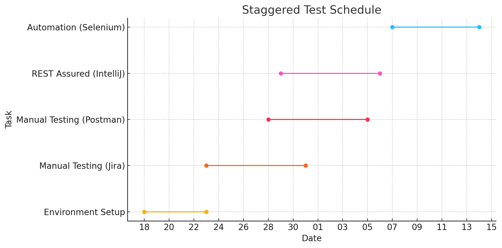

# Test Plan for Social Network Application

## 1. Overview

This comprehensive test plan outlines the approach for thoroughly validating the social network application, ensuring its core functionalities are robust, reliable, and efficient. The plan employs a combination of manual, API, automated, and performance testing to deliver a high-quality product. Key areas of focus include:

- **Manual Testing**: In-depth validation of all essential functionalities, including user registration, login, post creation, and user interactions. This approach will cover complex scenarios, edge cases, and negative testing that are less suited for automation.
- **API Testing**: Using Postman to rigorously test backend services, ensuring accurate and reliable data handling. This will involve verifying CRUD operations, error handling, security protocols, and overall API performance.
- **Automation**: Employing Selenium WebDriver and Java to streamline the testing of repetitive scenarios, such as user registration and post creation, across multiple browsers. Automation will enhance test efficiency and maintain a consistent level of quality.
- **Performance Testing**: Leveraging JMeter to simulate high-traffic conditions and measure system stability and responsiveness. Stress testing will help identify potential bottlenecks and ensure the application can gracefully handle heavy loads.

---

## Scope of Testing

The tests will cover the following key functionalities:

- **Manual Testing**: User registration, login, post creation, likes, comments, profile management, and user interactions.
- **API Testing**: CRUD operations (create, read, update, delete) for users and posts using **Postman**.
- **Automation**: Core scenarios such as registration, login, and post creation using **Selenium WebDriver and Java**.
- **Cross-browser Testing**: Testing on **Google Chrome**, **Mozilla Firefox**, and **Safari**.
- **Cross-platform Testing**: Testing on **macOS** and **Windows**.
- **Performance Testing**: Load testing to ensure system performance under high traffic.

What will NOT be tested:

- **Third-party integrations**: The plan will not cover performance testing of external APIs or services integrated with the application.
- **Detailed UI/UX design validation**: Pixel-perfect UI comparisons or deep aesthetic checks for design consistency will not be performed.
- **Performance on unsupported browsers or devices**: The application will not be tested on browsers or devices outside of Chrome, Firefox, Safari, macOS, and Windows.

---

## Objectives of Testing

1. **Manual Testing** -  
   This will involve detailed validation of the application’s core functionalities, including user registration, login, post creation, user interactions (likes, comments, and connections), and profile management. Manual testing will also cover boundary cases, negative testing, and scenarios that are challenging to automate. Additionally, it will focus on ensuring a smooth user experience and identifying any issues that may not be detected through automation.

2. **API Testing** -  
   Using Postman, we will test backend services to ensure accurate and efficient data handling. This includes validating CRUD operations (Create, Read, Update, Delete) for both users and posts. We will also test the APIs’ security, error handling, and performance under various conditions. The goal is to ensure that all API endpoints respond correctly with the expected status codes and data formats, even under edge cases or high loads.

3. **Automated Testing** -  
   Automation will be conducted using Selenium WebDriver and Java to increase the efficiency and reliability of regression testing. The focus will be on automating high-priority scenarios such as user registration, login, and post creation. Automation scripts will be designed to run across different browsers to ensure cross-browser compatibility. The use of page object models and data-driven testing techniques will make the scripts robust and maintainable.

4. **Performance Testing** -  
   Utilizing JMeter, performance testing will be conducted to assess the application's behavior under high traffic and concurrent user loads. We will simulate real-world scenarios to identify potential bottlenecks and ensure that the system maintains acceptable response times and stability. Stress testing will also be performed to determine the maximum capacity of the application and its ability to recover gracefully from failures.

---

## Testing Strategy

To ensure the quality and stability of the social network application, we have developed a comprehensive testing strategy that encompasses manual testing, automation, and API verification:

1. **Manual Testing**: Initially, we will perform thorough checks of core functionalities such as user registration, login, post creation, likes, comments, and profile management. The goal is to identify and document all critical and high-risk bugs in **Jira**. Our team will employ "exploratory testing" techniques to cover edge cases and unpredictable scenarios to ensure comprehensive coverage.

2. **API Testing with Postman**: Once the initial manual testing and bug documentation are completed, we will use **Postman** to validate all key API endpoints. This will include not only basic CRUD operations (Create, Read, Update, Delete) but also the system's behavior for various response statuses (200 OK, 404 Not Found, 500 Internal Server Error, etc.). We will also test API security by checking for proper handling of unauthorized requests and error management.

3. **Automated Testing with Selenium WebDriver**: After resolving major issues, we will begin automation using **IntelliJ** and **Selenium WebDriver** to streamline regression testing. The focus will be on automating critical user flows like registration, login, and post creation, ensuring there are no regressions with each update. We will implement the "page object model" design pattern and use data-driven testing techniques to make our scripts robust and easily maintainable across multiple browsers.

4. **Cross-browser Testing**: We will validate the application's performance on major browsers, including **Google Chrome**, **Mozilla Firefox**, and **Safari**, to ensure a consistent user experience and prevent compatibility issues. These tests will be automated using Selenium Grid to cover various browser environments efficiently.

5. **Performance Testing with JMeter**: We will use **JMeter** to conduct load testing, simulating high user traffic and assessing system behavior under stress. The goal is to identify potential performance bottlenecks and ensure that the application remains stable under peak loads. Stress testing will be performed in different environments to measure the maximum performance capacity and evaluate the system's ability to recover gracefully from failures

---

## Risk Management and Mitigation Strategies

As a team of three developers, we are well-prepared to tackle any risks and challenges that may arise during testing. We rely on effective communication and proactive planning to maintain a smooth workflow and successfully complete our tasks. Here is our approach to risk management:

### Potential Risks:

- **Delays in Test Environment Setup**: Issues with configuration or technical limitations may cause delays.

- **Resource Shortages**: The absence of key tools, hardware, or time constraints could impact our work.

- **Requirement Changes**: When system requirements change, we need to quickly adapt our test cases and strategies.

- **Dependencies on External Systems**: Third-party dependencies could pose risks if those systems are not functioning properly.

### Risk Mitigation Strategies:

1. **Daily Stand-Up Calls**: We hold brief daily calls to share our progress, discuss current risks, and propose solutions. This keeps everyone informed and allows us to react quickly to potential problems.

2. **Weekly Meetings**: Once a week, we have an in-depth meeting to review achievements, discuss the project status, and identify both new and existing risks. We also plan mitigation strategies if things aren't going as expected.

3. **Backup Test Environments**: We maintain backup environments and virtual machines to ensure flexibility if issues arise with the primary setup.

4. **Resource Planning**: We allocate tasks and resources ahead of time, ensuring everyone knows their responsibilities. If needed, we can quickly reallocate resources to handle critical situations.

As a team, we believe that successful testing relies on good organization, efficient communication, and swift problem-solving. Our approach enables us to work in sync and stay prepared for any challenges that may arise.

---

## Entry Criteria

To begin the testing phase, the following prerequisites must be met to ensure smooth and effective test execution:

- **Fully Configured Test Environments**: All testing environments, including staging servers and databases, must be properly set up, stable, and accessible to the testing team. The test infrastructure should utilize **Docker Desktop** for efficient container management and **MariaDB** as the database solution for reliable and fast data storage. This setup ensures that all functionalities are tested in an environment as close to production as possible.

- **Validated Test Data**: Comprehensive and accurate test data for each scenario must be prepared and validated. This data should cover both standard use cases and edge cases to thoroughly assess the application’s behavior under various conditions.

- **Tool Installation and Configuration**: All necessary testing tools, such as **Postman** for API validation, **Selenium WebDriver** for automated UI testing, and required browsers (Google Chrome, Mozilla Firefox, Safari), must be installed and correctly configured on the testers' machines. Additionally, **Docker Desktop** should be installed and ready to manage containerized services, and **MariaDB** must be set up and operational for all testing needs.

- **Reviewed and Approved Test Cases**: Every test case must be meticulously documented, reviewed by the testing team, and approved to ensure complete coverage and accuracy. This step provides confidence that all key functionalities will be tested thoroughly

---

## Exit Criteria

To consider the testing phase complete for the context of a course project, the following conditions must be met:

- **All Planned Test Cases Executed**: All test scenarios outlined in the test plan must be fully executed and documented.

- **All Found Defects Documented**: Every discovered defect, regardless of severity, must be thoroughly documented, including the steps to reproduce and the expected behavior.

- **Reported Test Coverage**: The extent of test coverage must be clearly reported, specifying which functionalities have been covered and what percentage of core scenarios have been tested.

- **Automation Scripts Executed and Results Documented**: Even if some scripts do not pass successfully, the results of automated testing must be presented, along with explanations for any failures.

- **Performance Tests Conducted and Analyzed**: Performance testing must be carried out, and the results analyzed. Any weaknesses or bottlenecks observed should be documented and included in the analysis.

---

## Roles and Responsibilities

The testing team consists of **Ivan Velchev**, **Armine Stoykova**, and **Gabriel Georgiev**. Each member will share equal responsibilities, with tasks distributed to ensure that every tester gains experience and familiarity with all functionalities of the application. The work will be organized into three sprints in **Jira**, with an emphasis on flexibility and comprehensive understanding. The division of responsibilities is as follows:

- **Manual Testing**: Each tester will participate in testing all core functionalities, including user registration, login, post creation, comments, and profile management. Tasks will be rotated among team members to ensure everyone develops a strong understanding of each part of the application and can effectively identify issues in any area.

- **API Testing**: API testing responsibilities using **Postman** will be shared equally among the team. Every tester will have the opportunity to validate various CRUD operations (Create, Read, Update, Delete) for both users and posts. This approach will ensure that all team members build skills in API testing and are prepared to handle different testing scenarios.

- **Automation**: Automation tasks will be divided so that each member works on automating different scenarios, such as user registration, login, and post creation, using **Selenium WebDriver and Java**. This distribution will provide exposure to a range of automated tests and enhance each tester’s proficiency in automation.

- **Cross-browser Testing**: All testers will be responsible for testing the application across multiple browsers, including **Google Chrome**, **Mozilla Firefox**, and **Safari**. This ensures that each member is familiar with cross-browser testing and can detect compatibility issues in different environments.

- **Sprint and Task Management in Jira**: Tasks will be planned and managed over three sprints in **Jira**. The goal is for each team member to work on a variety of tasks and functionalities, ensuring thorough coverage of the application. Every tester will be responsible for reporting and documenting any bugs found, providing clear and detailed information in Jira, including steps to reproduce, screenshots, and other relevant details. This approach ensures that all testers are well-rounded and prepared for future projects.

---

## Test Scenarios

### 1. User Registration (Manual Testing)
- Validate registration with a valid username, password, and email.
- Check for error messages when the username length is incorrect, the password is weak, or the email format is invalid.

### 2. User Login (Manual Testing)
- Test successful login using valid credentials.
- Ensure error messages appear for incorrect email or password entries.

### 3. Post Creation (Manual Testing)
- Create a valid post with text and a photo to verify it appears in the news feed.
- Confirm if posts without photos are accepted.
- Verify that visibility settings work as expected and all elements display properly.

### 4. Anonymous Users (Manual Testing)
- Examine the visibility of the public menu and posts for anonymous users.
- Verify restrictions or redirection when anonymous users attempt to like content.

### 5. Authorized Users (Manual Testing)
- Ensure authorized users can interact with posts, including liking, commenting, and searching for profiles.
- Assess the personalized news feed generation and monitor performance when loading comments.

### 6. Search Function (Manual Testing)
- Test the search functionality by name and email.
- Review what results are visible to both authorized and unauthorized users.

### 7. Profile Management for Authorized Users (Manual Testing)
- Check if users can update their personal information, like name, profile picture, and visibility settings.
- Confirm that users can change their password and other profile details.

### 8. Interactions with Other Users (Manual Testing)
- Test sending and removing connection requests.
- Make sure disconnections are handled correctly without requiring the other user's approval.

### 9. Administrator Rights (Manual Testing)
- Verify that administrators have the ability to edit and delete posts and comments.
- Ensure that admins can modify user information as needed.

### 10. Optional Features (Manual Testing)
- Confirm that login is restricted for users who have not verified their email.
- Test the ID verification process and whether access to certain features is restricted until admin approval.

---

## REST API Functionality Overview

### 1. Users

#### · User Management
- Basic operations for managing user accounts, such as registration, profile updates, and account deletion.
- Friend-related actions, including sending and approving friend requests.
- Retrieving personalized content like user-specific news feeds.

### 2. Posts

#### · Content Management
- Creating, editing, and deleting user-generated posts.
- Comment functionality to add or view interactions on posts.
- Features to like or unlike posts and comments, supporting user engagement.

---

## Exception Handling and Propagation

To maintain the reliability of the API, it is essential to handle errors gracefully and ensure meaningful feedback is provided to users. The following outlines the areas of focus for testing exception handling:

#### Validation Errors
- Ensure the API returns clear error messages when input data fails validation checks, such as missing or improperly formatted fields.

#### Resource Not Found
- Verify that the API handles requests for non-existent resources appropriately, returning a suitable "not found" response.

#### Unauthorized Access
- Check that access to protected endpoints is restricted without valid authentication and returns an appropriate error message.

#### Forbidden Action
- Confirm that users are prevented from performing unauthorized actions, and the system responds with an appropriate "forbidden" message.

#### Internal Server Errors
- Simulate unexpected system errors to ensure the API handles them gracefully and provides a general error response without exposing sensitive information.

---

## REST ASSURED Functionality Overview

### 1. Users

- **CRUD Operations**: Create, retrieve, update, and delete user accounts.
- **Friend Management**: Send and approve friend requests.
- **News Feed**: Get the latest posts from connections.

---

### 2. Posts

- **CRUD Operations**: Create, view, update, and delete posts.
- **Comments**: Add and view comments on posts.
- **Like/Unlike**: Like or unlike posts and comments.

---

## Selenium WebDriver Functionality Overview

### 1. User Flows
- Automate key scenarios like user registration, login, and post creation.

### 2. Cross-Browser Testing
- Verify functionality across multiple browsers, including Chrome, Firefox, and Safari.

### 3. UI Interactions
- Simulate user actions such as clicking buttons, liking posts, submitting forms, and navigating pages.

### 4. Data-Driven Testing
- Execute tests using different sets of input data to ensure system reliability under various conditions.

---

## Test Schedule

---

## Tools and Technologies

- **Postman**: A powerful tool for **API testing** that allows us to validate RESTful services. Postman provides an easy-to-use interface for creating API requests, analyzing responses, and automating workflows for efficient testing.

- **Java**: The primary programming language used for **writing automation scripts** with Selenium WebDriver. Java is highly compatible with Selenium and offers a robust environment for creating maintainable and efficient automated tests.

- **IntelliJ IDEA**: An integrated development environment (IDE) used for **developing and running Java-based automation scripts**. IntelliJ provides powerful features like code completion, debugging tools, and seamless integration with testing frameworks, enhancing productivity and efficiency.

- **Selenium WebDriver with Java**: A robust framework for **automated user interface testing**. Selenium WebDriver is widely used for automating browser actions and verifying web application behavior across different browsers.

- **Selenium IDE**: An easy-to-use tool for **recording and playing back browser interactions**. It is useful for creating initial scripts that can be exported to Selenium WebDriver for more complex automation.

- **JMeter**: A tool for **performance and load testing**. JMeter simulates real-world traffic scenarios, assesses system performance under load, and identifies potential bottlenecks to ensure stability.

- **Docker Desktop**: Used to set up and run the **API locally** in isolated containers. Docker Desktop ensures a consistent setup across different machines, simplifying the deployment and testing of services.

- **Jira/Trello**: Tools for **bug tracking and task management**. Jira is ideal for project management in Agile environments, while Trello provides a visual approach for organizing tasks and enhancing team collaboration.

---

## Success Criteria

1. **Complete Test Execution**: Ensure that all planned test cases, both manual and automated, are fully executed. Our goal is to cover all core functionalities, such as user registration, login, post creation, user interactions, and profile management.

2. **Accurate Reporting**: Document all discovered bugs, defects, or issues encountered during testing in detail. Reports should include clear steps to reproduce, observed vs. expected outcomes, severity levels, and any relevant screenshots or logs.

3. **API Validation**: Verify that all API endpoints respond correctly with appropriate status codes (e.g., 200 for success, 401 for unauthorized) and handle data securely and efficiently. Document all API test results, highlighting discrepancies or performance issues.

4. **Automation Success**: Automated tests using Selenium WebDriver should run without errors, covering critical scenarios (such as registration, login, and post creation). Report the results and efficiency of these automated tests, including any need for script maintenance.

5. **Performance**: Conduct performance testing using JMeter to assess the application's behavior under simulated high traffic. Report the system's stability, response times, and any identified bottlenecks or areas for improvement.

6. **Testing Documentation**: Provide a comprehensive overview of the testing strategy, tools used, and detailed findings. This should include a summary of what was tested, how it was tested, and the issues found and reported.
